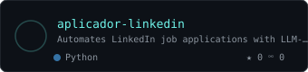
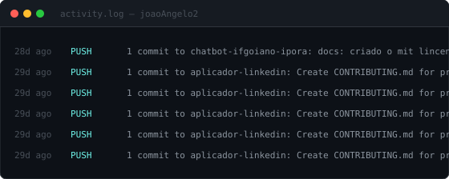

  

  

  
  &nbsp;&nbsp;&nbsp;&nbsp;&nbsp;
  
  &nbsp;&nbsp;&nbsp;&nbsp;&nbsp;
  
  &nbsp;&nbsp;&nbsp;&nbsp;&nbsp;
  
  &nbsp;&nbsp;&nbsp;&nbsp;&nbsp;
  

<h2>💻&nbsp;&nbsp;Tech Stacks</h2>

<h2>📘&nbsp;&nbsp;Projects</h2>

&nbsp;&nbsp;&nbsp;&nbsp;&nbsp;<big><big><strong>Python</strong></big></big>&nbsp;&nbsp;&nbsp;

<!--START_SECTION:python-->

<!--END_SECTION:python-->

&nbsp;&nbsp;&nbsp;&nbsp;&nbsp;<big><big><strong>TypeScript</strong></big></big>&nbsp;&nbsp;&nbsp;

<!--START_SECTION:typescript-->

<!--END_SECTION:typescript-->

&nbsp;&nbsp;&nbsp;&nbsp;&nbsp;<big><big><strong>Java</strong></big></big>&nbsp;&nbsp;&nbsp;

<!--START_SECTION:java-->

<!--END_SECTION:java-->

&nbsp;&nbsp;&nbsp;&nbsp;&nbsp;<big><big><strong>Android</strong></big></big>&nbsp;&nbsp;&nbsp;

<!--START_SECTION:android-->

<!--END_SECTION:android-->

<h2>📊&nbsp;&nbsp;Activity</h2>

<!--START_SECTION:activity-->

<!--END_SECTION:activity-->

